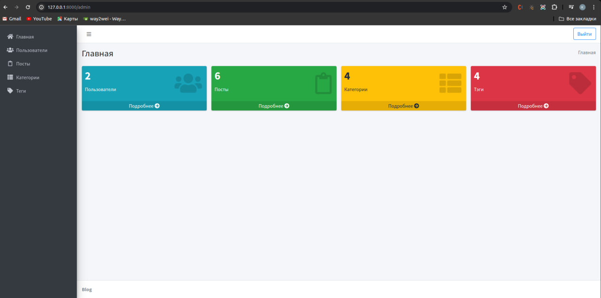
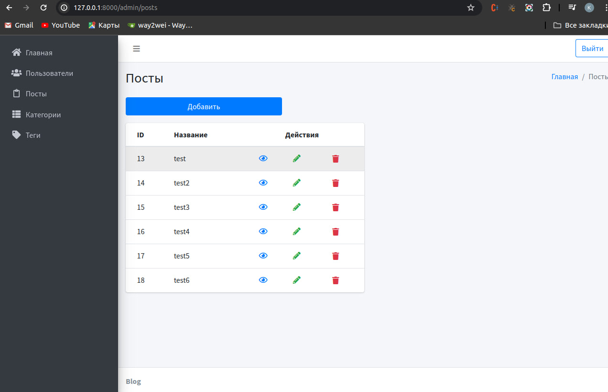
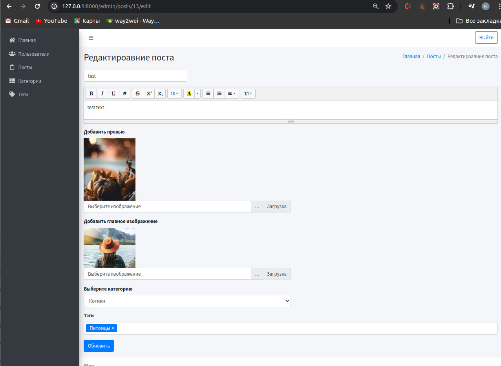
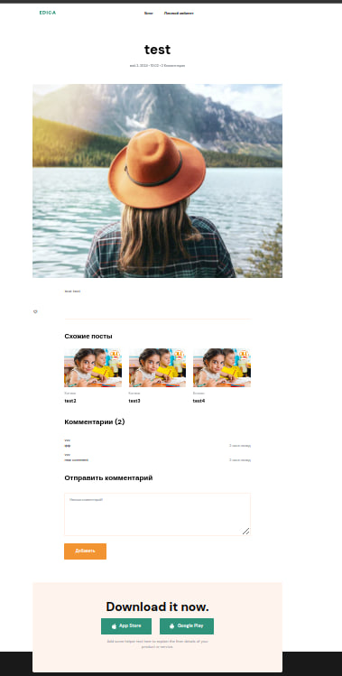
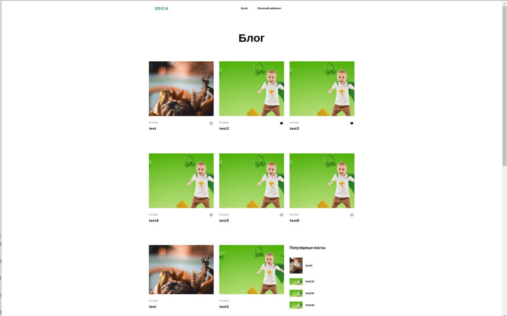
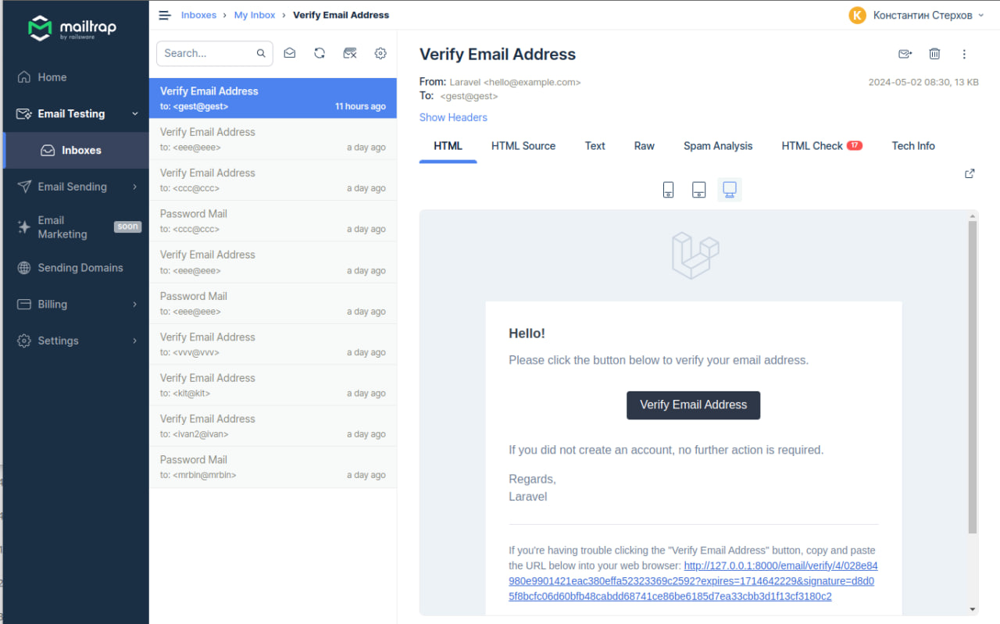

# ОБЩЕЕ ОПИСАНИЕ ПРОЕКТА

В данном проекте реализован Блог
CRUD для Пользователей, Постов, Категорий, Тегов.

laravel/ui bootstrap AdminLTE-3.2.0

# ИНСТАЛЯЦИЯ

Склонируйте проект в директорию с сервером:

`git clone https://github.com/SterxovK/laravel_blog.git`

Затем, открыв из папки проекта консоль, введите команду для установки пакетов ларавель:

`composer install`

Создайте базу данных sqlite и заполните поля файла .env

DB_CONNECTION=sqlite

Регистрация пользователей с подтверждением по email реализована с сервисом https://mailtrap.io/ (потребуется VPN для корректной работы с сервисом).

В открытой консоли директории проекта введите команду для генерации таблиц базы данных:

`php artisan migrate`

В той же консоли для запуска сайта по адресу `http://localhost:8000` введите команды:

`php artisan serve`
'npm run dev'
'php artisan queue:work'

Откройте сайт в браузере по адресу  `http://localhost:8000

реализовано CRUD для Пользователей, Постов, Категорий, Тегов.

#Pages

